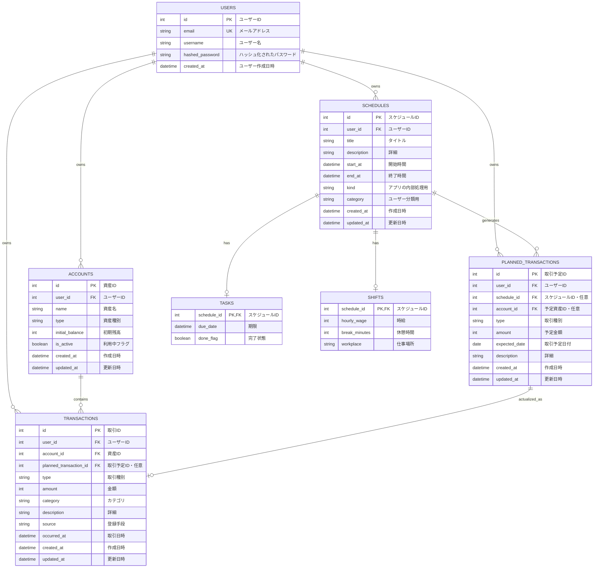

# Taskal ER Diagram

```mermaid
erDiagram

    USERS ||--o{ SCHEDULES : owns
    USERS ||--o{ ACCOUNTS : owns
    USERS ||--o{ PLANNED_TRANSACTIONS : owns
    USERS ||--o{ TRANSACTIONS : owns

    SCHEDULES ||--o| TASKS : has
    SCHEDULES ||--o| SHIFTS : has
    SCHEDULES ||--o{ PLANNED_TRANSACTIONS : generates

    ACCOUNTS ||--o{ TRANSACTIONS : contains

    PLANNED_TRANSACTIONS ||--o| TRANSACTIONS : actualized_as


    USERS {
        int id PK "ユーザーID"
        string email UK "メールアドレス"
        string username "ユーザー名"
        string hashed_password "ハッシュ化されたパスワード"
        datetime created_at "ユーザー作成日時"
    }


    SCHEDULES {
        int id PK "スケジュールID"
        int user_id FK "ユーザーID"
        string title "タイトル"
        string description "詳細"
        datetime start_at "開始時間"
        datetime end_at "終了時間"
        string kind "アプリの内部処理用"
        string category "ユーザー分類用"
        datetime created_at "作成日時"
        datetime updated_at "更新日時"
    }


    TASKS {
        int schedule_id PK, FK "スケジュールID"
        datetime due_date "期限"
        boolean done_flag "完了状態"
    }


    SHIFTS {
        int schedule_id PK, FK "スケジュールID"
        int hourly_wage "時給"
        int break_minutes "休憩時間"
        string workplace "仕事場所"
    }


    ACCOUNTS {
        int id PK "資産ID"
        int user_id FK "ユーザーID"
        string name "資産名"
        string type "資産種別"
        int initial_balance "初期残高"
        boolean is_active "利用中フラグ"
        datetime created_at "作成日時"
        datetime updated_at "更新日時"
    }


    PLANNED_TRANSACTIONS {
        int id PK  "取引予定ID"
        int user_id FK  "ユーザーID"
        int schedule_id FK "スケジュールID・任意"
        int account_id FK "予定資産ID・任意"
        string type "取引種別"
        int amount "予定金額"
        date expected_date "取引予定日付"
        string description "詳細"
        datetime created_at "作成日時"
        datetime updated_at "更新日時"
    }


    TRANSACTIONS {
        int id PK "取引ID"
        int user_id FK "ユーザーID"
        int account_id FK "資産ID"
        int planned_transaction_id FK "取引予定ID・任意"
        string type "取引種別"
        int amount "金額"
        string category "カテゴリ"
        string description "詳細"
        string source "登録手段"
        datetime occurred_at "取引日時"
        datetime created_at "作成日時"
        datetime updated_at "更新日時"
    }
```